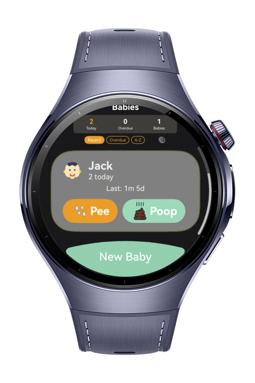
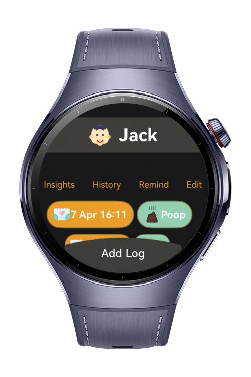
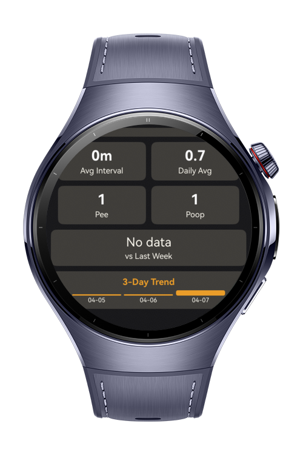

> **Note:** To access all shared projects, get information about environment setup, and view other guides, please
> visit [Explore-In-HMOS-Wearable Index](https://github.com/Explore-In-HMOS-Wearable/hmos-index).

# Baby Day Tracker

**Baby Day Tracker** is a HarmonyOS Next wearable app designed for caregivers to track newborn diaper changes for one or
more babies. It runs on Huawei Watch 5 and provides quick-log actions, history filtering, care insights, reminders, and
settings — all optimized for small watch screens.

# Preview

<div>
  
  
  
  
</div>

# Use Cases

## Baby Management

- Add, edit, and archive baby profiles (name, birth date, gender)
- Quick swipe-to-delete with confirmation dialog
- Per-baby diaper history with enriched log entries (type, intensity, condition, notes, manual timestamp)

## Quick Logging

- One-tap quick pee/poo entry from the home screen
- Full log form with manual date/time selection and optional details

## Dashboard & Home

- Cross-baby overview with today log count, overdue count, and active baby count
- Persistent sort controls (Recent, Overdue First, A–Z)
- Overdue indicators on baby cards
- Quick-log buttons on each baby card

## History & Insights

- Per-baby history screen with date-range filters (Today, 7D, 30D, All)
- Diaper type filters (All, Pee, Poo)
- Grouped timeline view by date
- Dedicated insights dashboard with today's count, weekly trend, and comparison vs last week

## Reminders

- Global timer-based reminders using HarmonyOS `reminderAgentManager`
- Notification permission request with graceful fallback
- Enable/disable reminders from each baby detail page or Settings

## Settings

- Toggle archive visibility
- Persistent home sort order selection
- Default history period preference
- Reminder enable/disable
- Onboarding reset
- Backup export (generates JSON snapshot of all babies, logs, and preferences)

## First-Run Onboarding

- 3-page swipeable intro explaining core product value
- Appears on first launch only; resets via Settings

# Technology

## Stack

- **Languages**: ArkTS, TypeScript
- **Frameworks**: HarmonyOS SDK 6.0.0(20)
- **Tools**: DevEco Studio Version 6.0.0(20)
- **Libraries**:
    - `@kit.ArkUI` — UI components and Arc UI
    - `@kit.AbilityKit` — ability lifecycle and context
    - `@kit.ArkData` — relational database (RDB) persistence
    - `@kit.BackgroundTasksKit` — `reminderAgentManager` for timer reminders
    - `@kit.NotificationKit` — `notificationManager` for permission and notifications
    - `@kit.CoreFileKit` — `BackupExtensionAbility` for system backup hooks
    - `@kit.BasicServicesKit` — `BusinessError` for typed error handling
    - `@ohos.data.preferences` — key-value preferences persistence

# Directory Structure

```
├── entry/src/main/ets/
│   ├──entryability/
│   │  └──EntryAbility.ets              // Main entry point ability
│   ├──entrybackupability/
│   │  └──EntryBackupAbility.ets        // Backup entry ability
│   ├──pages/
│   │  ├──Index.ets                     // App start page / navigation root
├──feature_home/src/main/ets
│   ├──components
│   │   ├──BabyBirthSelect.ets 
│   │   ├──BabyListItem.ets 
│   │   ├──ConfirmDialog.ets 
│   │   ├──EmptyState.ets 
│   │   ├──ErrorState.ets 
│   │   ├──HomeHeader.ets 
│   │   ├──LoadingState.ets 
│   │   └──GenderSelect.ets 
│   ├──lib
│   │   ├──date-utils.ets 
│   │   └──SizeConstants.ets 
│   ├──models
│   │   ├──Baby.ets 
│   │   ├──InsightsSummary.ets 
│   │   ├──UiState.ets 
│   │   └──Diaper.ets 
│   ├──pages
│   │   ├──AddBabyLogPage.ets 
│   │   ├──AddBabyPage.ets 
│   │   ├──BabyPage.ets 
│   │   ├──DiaperDetailPage.ets 
│   │   ├──EditBabyPage.ets 
│   │   ├──HistoryPage.ets 
│   │   ├──InsightsPage.ets 
│   │   ├──OnboardingPage.ets 
│   │   ├──PageParams.ets 
│   │   ├──SettingsPage.ets 
│   │   └──HomePage.ets 
│   ├──viewmodels
│   │   ├──BabyViewModel.ets 
│   │   ├──DiaperViewModel.ets 
│   │   ├──HistoryViewModel.ets 
│   │   ├──SettingsViewModel.ets 
│   │   └──ListDataSouce.ets
│   ├──services
│   │   └──InsightsService.ets 
│   ├──views
│   │   ├──AddBabyView.ets 
│   │   ├──BabyView.ets 
│   │   ├──DiaperView.ets 
│   │   ├──EditBabyView.ets 
│   │   ├──HistoryView.ets 
│   │   ├──InsightsView.ets 
│   │   ├──SettingsView.ets 
│   │   └──HomeView.ets 
├──feature_splash/src/main/ets
│   ├──components
│   │   └──Loader.ets 
│   └──SplashPage.ets 
├──feature_store/src/main/ets
│   ├──table
│   │   ├──BabyTable.ets 
│   │   ├──DiaperTable.ets 
│   │   └──RDBTable.ets 
│   ├──preferences
│   │   └──AppPreferencesService.ets 
│   ├──repository
│   │   ├──BabyRepository.ets 
│   │   └──DiaperRepository.ets 
│   ├──services
│   │   ├──BackupService.ets 
│   │   └──ReminderService.ets
│   ├──lib
│   │   └──GlobalContext.ets
│   ├──Database.ets
│   └──Interfaces.ets

```

# Constraints and Restrictions

## Supported Device

- Huawei Watch 5

# LICENSE

**Baby Day Tracker** is distributed under the terms of the MIT License.
See the [license](LICENSE) for more information.